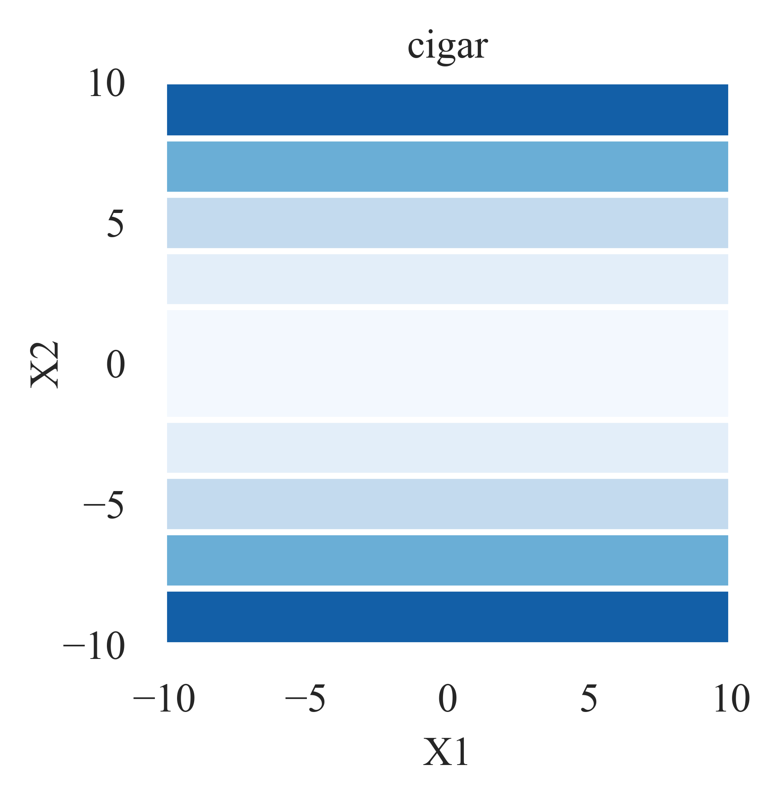

Benchmarking Functions for BBO
==============================

In this open-source Python module, we have provided a set of **benchmarking/test functions**
which have been commonly used in the black-box optimization / zeroth-order optimization /
gradient-free optimization / derivative-free optimization /
`global optimization <https://link.springer.com/journal/10898>`_ /
direct search / randomized optimization / meta-heuristics / evolutionary algorithms / swarm
intelligence community. 

.. Note :: In the coming days, we are planning to add some challenging BBO models from various
   **real-world applications**. Since this is a *long-term* development project, welcome
   anyone to make open-source contributions to it.

For a set of 23 benchmarking/test functions, their **base** forms, **shifted/transformed**
forms, **rotated** forms, and **rotated-shifted** forms have been coded and *well-tested*.
Typically, their **rotated-shifted** forms should be employed in **Comparison Experiments**
for BBO, in order to avoid possible biases towards certain search points (e.g., the origin)
or separability.

Checking of Coding Correctness
------------------------------

For all testing code of benchmarking functions, please refer to the following openly accessible
links for details (In fact, we have spent much time in checking of Python coding correctness):

* `for base forms <https://github.com/Evolutionary-Intelligence/pypop/blob/main/pypop7/benchmarks/test_base_functions.py>`_
* `for shifted/transformed forms <https://github.com/Evolutionary-Intelligence/pypop/blob/main/pypop7/benchmarks/test_shifted_functions.py>`_
* `for rotated forms <https://github.com/Evolutionary-Intelligence/pypop/blob/main/pypop7/benchmarks/test_rotated_functions.py>`_
* `for rotated-shifted forms <https://github.com/Evolutionary-Intelligence/pypop/blob/main/pypop7/benchmarks/test_continuous_functions.py>`_

Base Functions
--------------

In the following, we will introduce **base** forms of some common benchmarking functions,
as presented below:

.. autofunction:: pypop7.benchmarks.base_functions.sphere

* Jastrebski, G.A. and Arnold, D.V., 2006, July.
  Improving evolution strategies through active covariance matrix adaptation.
  In IEEE International Conference on Evolutionary Computation (pp. 2814-2821). IEEE.

.. autofunction:: pypop7.benchmarks.base_functions.cigar

* Jastrebski, G.A. and Arnold, D.V., 2006, July.
  Improving evolution strategies through active covariance matrix adaptation.
  In IEEE International Conference on Evolutionary Computation (pp. 2814-2821). IEEE.

.. autofunction:: pypop7.benchmarks.base_functions.discus

.. image:: images/discus.png
   :width: 321px
   :align: center

* Jastrebski, G.A. and Arnold, D.V., 2006, July.
  Improving evolution strategies through active covariance matrix adaptation.
  In IEEE International Conference on Evolutionary Computation (pp. 2814-2821). IEEE.

.. autofunction:: pypop7.benchmarks.base_functions.cigar_discus

.. image:: images/cigar_discus.png
   :width: 321px
   :align: center

* Jastrebski, G.A. and Arnold, D.V., 2006, July.
  Improving evolution strategies through active covariance matrix adaptation.
  In IEEE International Conference on Evolutionary Computation (pp. 2814-2821). IEEE.

.. autofunction:: pypop7.benchmarks.base_functions.ellipsoid

.. image:: images/ellipsoid.png
   :width: 321px
   :align: center

* Jastrebski, G.A. and Arnold, D.V., 2006, July.
  Improving evolution strategies through active covariance matrix adaptation.
  In IEEE International Conference on Evolutionary Computation (pp. 2814-2821). IEEE.

.. autofunction:: pypop7.benchmarks.base_functions.different_powers

.. image:: images/different_powers.png
   :width: 321px
   :align: center

* Jastrebski, G.A. and Arnold, D.V., 2006, July.
  Improving evolution strategies through active covariance matrix adaptation.
  In IEEE International Conference on Evolutionary Computation (pp. 2814-2821). IEEE.

.. autofunction:: pypop7.benchmarks.base_functions.schwefel221

.. image:: images/schwefel221.png
   :width: 321px
   :align: center

.. autofunction:: pypop7.benchmarks.base_functions.step

.. autofunction:: pypop7.benchmarks.base_functions.schwefel222

.. autofunction:: pypop7.benchmarks.base_functions.rosenbrock

* Jastrebski, G.A. and Arnold, D.V., 2006, July. Improving evolution strategies through active covariance matrix adaptation. In IEEE International Conference on Evolutionary Computation (pp. 2814-2821). IEEE.

.. autofunction:: pypop7.benchmarks.base_functions.schwefel12

.. autofunction:: pypop7.benchmarks.base_functions.exponential

.. autofunction:: pypop7.benchmarks.base_functions.griewank

.. image:: images/griewank.png
   :width: 321px
   :align: center

.. image:: images/surface_griewank.png
   :width: 321px
   :align: center

.. autofunction:: pypop7.benchmarks.base_functions.bohachevsky

.. image:: images/bohachevsky_2.png
   :width: 321px
   :align: center

.. image:: images/surface_bohachevsky_2.png
   :width: 321px
   :align: center

.. image:: images/bohachevsky.png
   :width: 321px
   :align: center

.. image:: images/surface_bohachevsky.png
   :width: 321px
   :align: center

.. autofunction:: pypop7.benchmarks.base_functions.ackley

.. image:: images/ackley.png
   :width: 321px
   :align: center

.. image:: images/surface_ackley.png
   :width: 321px
   :align: center

.. autofunction:: pypop7.benchmarks.base_functions.rastrigin

.. image:: images/rastrigin.png
   :width: 321px
   :align: center

.. image:: images/surface_rastrigin.png
   :width: 321px
   :align: center

.. autofunction:: pypop7.benchmarks.base_functions.scaled_rastrigin

.. autofunction:: pypop7.benchmarks.base_functions.skew_rastrigin

.. autofunction:: pypop7.benchmarks.base_functions.levy_montalvo

.. image:: images/levy_montalvo.png
   :width: 321px
   :align: center

.. image:: images/surface_levy_montalvo.png
   :width: 321px
   :align: center

.. autofunction:: pypop7.benchmarks.base_functions.michalewicz

.. image:: images/michalewicz.png
   :width: 321px
   :align: center

.. image:: images/surface_michalewicz.png
   :width: 321px
   :align: center

.. autofunction:: pypop7.benchmarks.base_functions.salomon

.. image:: images/salomon.png
   :width: 321px
   :align: center

.. image:: images/surface_salomon.png
   :width: 321px
   :align: center

.. autofunction:: pypop7.benchmarks.base_functions.shubert

.. image:: images/shubert.png
   :width: 321px
   :align: center

.. image:: images/surface_shubert.png
   :width: 321px
   :align: center

.. autofunction:: pypop7.benchmarks.base_functions.schaffer

.. image:: images/schaffer.png
   :width: 321px
   :align: center

.. image:: images/surface_schaffer.png
   :width: 321px
   :align: center

Shifted/Transformed Forms
-------------------------

In the following, we will introduce **shifted/transformed** forms of the above
`base functions <https://pypop.readthedocs.io/en/latest/benchmarks.html#base-functions>`_,
as presented below:

.. autofunction:: pypop7.benchmarks.shifted_functions.generate_shift_vector

.. autofunction:: pypop7.benchmarks.shifted_functions.load_shift_vector

.. autofunction:: pypop7.benchmarks.shifted_functions.sphere

.. autofunction:: pypop7.benchmarks.shifted_functions.cigar

.. autofunction:: pypop7.benchmarks.shifted_functions.discus

.. autofunction:: pypop7.benchmarks.shifted_functions.cigar_discus

.. autofunction:: pypop7.benchmarks.shifted_functions.ellipsoid

.. autofunction:: pypop7.benchmarks.shifted_functions.different_powers

.. autofunction:: pypop7.benchmarks.shifted_functions.schwefel221

.. autofunction:: pypop7.benchmarks.shifted_functions.step

.. autofunction:: pypop7.benchmarks.shifted_functions.schwefel222

.. autofunction:: pypop7.benchmarks.shifted_functions.rosenbrock

.. autofunction:: pypop7.benchmarks.shifted_functions.schwefel12

.. autofunction:: pypop7.benchmarks.shifted_functions.exponential

.. autofunction:: pypop7.benchmarks.shifted_functions.griewank

.. autofunction:: pypop7.benchmarks.shifted_functions.bohachevsky

.. autofunction:: pypop7.benchmarks.shifted_functions.ackley

.. autofunction:: pypop7.benchmarks.shifted_functions.rastrigin

.. autofunction:: pypop7.benchmarks.shifted_functions.scaled_rastrigin

.. autofunction:: pypop7.benchmarks.shifted_functions.skew_rastrigin

.. autofunction:: pypop7.benchmarks.shifted_functions.levy_montalvo

.. autofunction:: pypop7.benchmarks.shifted_functions.michalewicz

.. autofunction:: pypop7.benchmarks.shifted_functions.salomon

.. autofunction:: pypop7.benchmarks.shifted_functions.shubert

.. autofunction:: pypop7.benchmarks.shifted_functions.schaffer

Rotated Forms
-------------

In the following, we will introduce **rotated** forms of the above
`base functions <https://pypop.readthedocs.io/en/latest/benchmarks.html#base-functions>`_,
as presented below:

.. autofunction:: pypop7.benchmarks.rotated_functions.generate_rotation_matrix

.. autofunction:: pypop7.benchmarks.rotated_functions.load_rotation_matrix

.. autofunction:: pypop7.benchmarks.rotated_functions.generate_shift_vector

.. autofunction:: pypop7.benchmarks.rotated_functions.load_shift_vector

.. autofunction:: pypop7.benchmarks.rotated_functions.sphere

.. autofunction:: pypop7.benchmarks.rotated_functions.cigar

.. autofunction:: pypop7.benchmarks.rotated_functions.discus

.. autofunction:: pypop7.benchmarks.rotated_functions.cigar_discus

.. autofunction:: pypop7.benchmarks.rotated_functions.ellipsoid

.. autofunction:: pypop7.benchmarks.rotated_functions.different_powers

.. autofunction:: pypop7.benchmarks.rotated_functions.schwefel221

.. autofunction:: pypop7.benchmarks.rotated_functions.step

.. autofunction:: pypop7.benchmarks.rotated_functions.schwefel222

.. autofunction:: pypop7.benchmarks.rotated_functions.rosenbrock

.. autofunction:: pypop7.benchmarks.rotated_functions.schwefel12

.. autofunction:: pypop7.benchmarks.rotated_functions.exponential

.. autofunction:: pypop7.benchmarks.rotated_functions.griewank

.. autofunction:: pypop7.benchmarks.rotated_functions.bohachevsky

.. autofunction:: pypop7.benchmarks.rotated_functions.ackley

.. autofunction:: pypop7.benchmarks.rotated_functions.rastrigin

.. autofunction:: pypop7.benchmarks.rotated_functions.scaled_rastrigin

.. autofunction:: pypop7.benchmarks.rotated_functions.skew_rastrigin

.. autofunction:: pypop7.benchmarks.rotated_functions.levy_montalvo

.. autofunction:: pypop7.benchmarks.rotated_functions.michalewicz

.. autofunction:: pypop7.benchmarks.rotated_functions.salomon

.. autofunction:: pypop7.benchmarks.rotated_functions.shubert

.. autofunction:: pypop7.benchmarks.rotated_functions.schaffer

Rotated-Shifted Forms
---------------------

In the following, we will introduce **rotated-shifted** forms of the above
`base functions <https://pypop.readthedocs.io/en/latest/benchmarks.html#base-functions>`_,
as presented below:

.. autofunction:: pypop7.benchmarks.continuous_functions.load_shift_and_rotation

.. autofunction:: pypop7.benchmarks.continuous_functions.sphere

.. autofunction:: pypop7.benchmarks.continuous_functions.cigar

.. autofunction:: pypop7.benchmarks.continuous_functions.discus

.. autofunction:: pypop7.benchmarks.continuous_functions.cigar_discus

.. autofunction:: pypop7.benchmarks.continuous_functions.ellipsoid

.. autofunction:: pypop7.benchmarks.continuous_functions.different_powers

.. autofunction:: pypop7.benchmarks.continuous_functions.schwefel221

.. autofunction:: pypop7.benchmarks.continuous_functions.step

.. autofunction:: pypop7.benchmarks.continuous_functions.schwefel222

.. autofunction:: pypop7.benchmarks.continuous_functions.rosenbrock

.. autofunction:: pypop7.benchmarks.continuous_functions.schwefel12

.. autofunction:: pypop7.benchmarks.continuous_functions.exponential

.. autofunction:: pypop7.benchmarks.continuous_functions.griewank

.. autofunction:: pypop7.benchmarks.continuous_functions.bohachevsky

.. autofunction:: pypop7.benchmarks.continuous_functions.ackley

.. autofunction:: pypop7.benchmarks.continuous_functions.rastrigin

.. autofunction:: pypop7.benchmarks.continuous_functions.scaled_rastrigin

.. autofunction:: pypop7.benchmarks.continuous_functions.skew_rastrigin

.. autofunction:: pypop7.benchmarks.continuous_functions.levy_montalvo

.. autofunction:: pypop7.benchmarks.continuous_functions.michalewicz

.. autofunction:: pypop7.benchmarks.continuous_functions.salomon

.. autofunction:: pypop7.benchmarks.continuous_functions.shubert

.. autofunction:: pypop7.benchmarks.continuous_functions.schaffer

Benchmarking for Large-Scale BBO (LBO)
--------------------------------------

Here we have provided two different benchmarking cases (**local vs global search**)
for large-scale black-box optimization (LBO):

.. autoclass:: pypop7.benchmarks.lbo.Experiment
   :members: 

   .. automethod:: __init__

.. autoclass:: pypop7.benchmarks.lbo.Experiments
   :members: 

   .. automethod:: __init__

.. autofunction:: pypop7.benchmarks.lbo.benchmark_local_search

.. autofunction:: pypop7.benchmarks.lbo.benchmark_global_search

Black-Box Classification from Data Science
------------------------------------------

Here we have provided a family of test functions from **black-box classification**
of data science:

.. autofunction:: pypop7.benchmarks.data_science.cross_entropy_loss_lr

.. autofunction:: pypop7.benchmarks.data_science.cross_entropy_loss_l2

.. autofunction:: pypop7.benchmarks.data_science.square_loss_lr

.. autofunction:: pypop7.benchmarks.data_science.logistic_loss_lr

.. autofunction:: pypop7.benchmarks.data_science.logistic_loss_l2

.. autofunction:: pypop7.benchmarks.data_science.tanh_loss_lr

.. autofunction:: pypop7.benchmarks.data_science.hinge_loss_perceptron

.. autofunction:: pypop7.benchmarks.data_science.loss_margin_perceptron

.. autofunction:: pypop7.benchmarks.data_science.loss_svm

.. autofunction:: pypop7.benchmarks.data_science.mpc2023_nonsmooth

.. autofunction:: pypop7.benchmarks.data_science.read_parkinson_disease_classification

.. autofunction:: pypop7.benchmarks.data_science.read_semeion_handwritten_digit

.. autofunction:: pypop7.benchmarks.data_science.read_cnae9

.. autofunction:: pypop7.benchmarks.data_science.read_madelon

.. autofunction:: pypop7.benchmarks.data_science.read_qsar_androgen_receptor

Benchmarking on Photonics Models from NeverGrad
-----------------------------------------------

Please refer to `NeverGrad <https://github.com/facebookresearch/nevergrad>`_ for an
introduction to the photonics model.

.. autofunction:: pypop7.benchmarks.never_grad.benchmark_photonics

Benchmarking of Controllers on Gymnasium
----------------------------------------

Please refer to `Gymnasium <https://gymnasium.farama.org/>`_ for an
introduction (from `Farama Foundation <https://farama.org/>`_).

.. autoclass:: pypop7.benchmarks.gymnasium.Cartpole
   :members:

   .. automethod:: __call__

.. autoclass:: pypop7.benchmarks.gymnasium.Ant
   :members:

   .. automethod:: __call__

.. autoclass:: pypop7.benchmarks.gymnasium.HalfCheetah
   :members:

   .. automethod:: __call__

.. autoclass:: pypop7.benchmarks.gymnasium.Hopper
   :members:

   .. automethod:: __call__

.. autoclass:: pypop7.benchmarks.gymnasium.Humanoid
   :members:

   .. automethod:: __call__

.. autoclass:: pypop7.benchmarks.gymnasium.Swimmer
   :members:

   .. automethod:: __call__

.. autoclass:: pypop7.benchmarks.gymnasium.Walker2d
   :members:

   .. automethod:: __call__

Lennard-Jones Cluster Optimization from PyGMO
---------------------------------------------

Please refer to `pagmo2 <https://esa.github.io/pagmo2/docs/cpp/problems/lennard_jones.html>`_
for an introduction (from `European Space Agency <https://www.esa.int/>`_) to this 444-d
Lennard-Jones cluster optimization problem from `PyGMO <https://esa.github.io/pygmo2/>`_.

.. autofunction:: pypop7.benchmarks.pygmo.lennard_jones

Test Classes and Data
---------------------

In the following, we will provide a set of test **classes** and test **data** for benchmarking
functions. Since these classes and data are used only for the *testing* purpose, end-users can
skip this section safely.

.. autoclass:: pypop7.benchmarks.cases.Cases
   :members:

.. autofunction:: pypop7.benchmarks.cases.get_y_sphere

.. autofunction:: pypop7.benchmarks.cases.get_y_cigar

.. autofunction:: pypop7.benchmarks.cases.get_y_discus

.. autofunction:: pypop7.benchmarks.cases.get_y_cigar_discus

.. autofunction:: pypop7.benchmarks.cases.get_y_ellipsoid

.. autofunction:: pypop7.benchmarks.cases.get_y_different_powers

.. autofunction:: pypop7.benchmarks.cases.get_y_schwefel221

.. autofunction:: pypop7.benchmarks.cases.get_y_step

.. autofunction:: pypop7.benchmarks.cases.get_y_schwefel222

.. autofunction:: pypop7.benchmarks.cases.get_y_rosenbrock

.. autofunction:: pypop7.benchmarks.cases.get_y_schwefel12

.. autofunction:: pypop7.benchmarks.cases.get_y_exponential

.. autofunction:: pypop7.benchmarks.cases.get_y_griewank

.. autofunction:: pypop7.benchmarks.cases.get_y_bohachevsky

.. autofunction:: pypop7.benchmarks.cases.get_y_ackley

.. autofunction:: pypop7.benchmarks.cases.get_y_rastrigin

.. autofunction:: pypop7.benchmarks.cases.get_y_scaled_rastrigin

.. autofunction:: pypop7.benchmarks.cases.get_y_skew_rastrigin

.. autofunction:: pypop7.benchmarks.cases.get_y_levy_montalvo

.. autofunction:: pypop7.benchmarks.cases.get_y_michalewicz

.. autofunction:: pypop7.benchmarks.cases.get_y_salomon

.. autofunction:: pypop7.benchmarks.cases.get_y_shubert

.. autofunction:: pypop7.benchmarks.cases.get_y_schaffer
