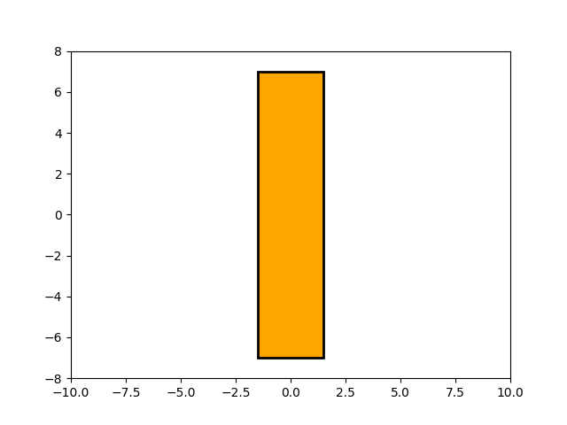
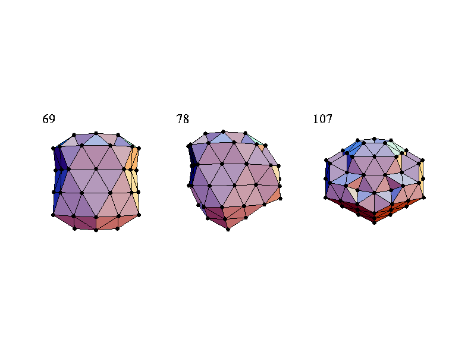

Tutorials
=========

Here we provide several *interesting* tutorials to help better use this library `PyPop7
<https://pypop.readthedocs.io/en/latest/installation.html>`_, as shown below:

* Lens Shape Optimization (15-dimensional)
* Lennard-Jones Cluster Optimization (444-dimensional)
* Benchmarking for Large-Scale Black-Box Optimization (up to 2000-dimensional)
* Benchmarking on the Well-Designed `COCO <https://github.com/numbbo/coco>`_ Platform (up to 640-dimensional)
* Benchmarking on the Famous `NeverGrad <https://github.com/facebookresearch/nevergrad>`_ Platform (developed
  recently by FacebookResearch)

For each black-box optimizer (BBO) from this open-source library, we also provide a *toy* example on their corresponding
`API <https://pypop.readthedocs.io/_/downloads/en/latest/pdf/>`_ documentations and two *testing* code (if possible) on
their corresponding `source code <https://github.com/Evolutionary-Intelligence/pypop/tree/main/pypop7/optimizers>`_
folders.

Lens Shape Optimization
-----------------------

This figure shows the (interesting) evolution process of lens shape, optimized by `MAES
<https://pypop.readthedocs.io/en/latest/es/maes.html>`_, a *simplified* modern version of the well-established
`CMA-ES <https://www.nature.com/articles/nature14544>`_ algorithm nearly without significant performance loss.

The objective of Lens Shape Optimization is to find the optimal shape of glass body such that parallel incident light
rays are concentrated in a given point on a plane while using a minimum of glass material possible.
Refer to `Beyer, 2020, GECCO <https://dl.acm.org/doi/abs/10.1145/3377929.3389870>`_ for more mathematical details
about the 15-dimensional objective function used here. To repeat this above figure, please run the following `code
<https://github.com/Evolutionary-Intelligence/pypop/blob/main/tutorials/lens_shape_optimization.py>`_:

.. code-block:: python

        import numpy as np
        import imageio.v2 as imageio  # for animation
        import matplotlib.pyplot as plt  # for static plotting
        from matplotlib.path import Path  # for static plotting
        import matplotlib.patches as patches  # for static plotting

        from pypop7.optimizers.es.es import ES  # abstract class for all ES
        from pypop7.optimizers.es.maes import MAES  # Matrix Adaptation Evolution Strategy

        # <1> - Set Parameters for Lens Shape Optimization (global)
        weight = 0.9  # weight of focus function
        r = 7  # radius of lens
        h = 1  # trapezoidal slices of height
        b = 20  # distance between lens and object
        eps = 1.5  # refraction index
        d_init = 3  # initialization

        # <2> - Define Objective Function (aka Fitness Function) to be Minimized
        def func_lens(x):  # refer to [Beyer, 2020, ACM-GECCO] for all mathematical details
            n = len(x)
            focus = r - ((h*np.arange(1, n) - 0.5) + b/h*(eps - 1)*np.transpose(np.abs(x[1:]) - np.abs(x[:(n-1)])))
            mass = h*(np.sum(np.abs(x[1:(n-1)])) + 0.5*(np.abs(x[0]) + np.abs(x[n-1])))
            return weight*np.sum(focus**2) + (1.0 - weight)*mass

        def get_path(x):  # only for plotting
            left, right, height = [], [], r
            for i in range(len(x)):
                x[i] = -x[i] if x[i] < 0 else x[i]
                left.append((-0.5*x[i], height))
                right.append((0.5*x[i], height))
                height -= 1
            points = left
            for i in range(len(right)):
                points.append(right[-i - 1])
            points.append(left[0])
            codes = [Path.MOVETO]
            for i in range(len(points) - 2):
                codes.append(Path.LINETO)
            codes.append(Path.CLOSEPOLY)
            return Path(points, codes)

        def plot(xs):
            file_names, frames = [], []
            for i in range(len(xs)):
                sub_figure = '_' + str(i) + '.png'
                fig = plt.figure()
                ax = fig.add_subplot(111)
                plt.rcParams['font.family'] = 'Times New Roman'
                plt.rcParams['font.size'] = '12'
                ax.set_xlim(-10, 10)
                ax.set_ylim(-8, 8)
                path = get_path(xs[i])
                patch = patches.PathPatch(path, facecolor='orange', lw=2)
                ax.add_patch(patch)
                plt.savefig(sub_figure)
                file_names.append(sub_figure)
            for image in file_names:
                frames.append(imageio.imread(image))
            imageio.mimsave('lens_shape_optimization.gif', frames, 'GIF', duration=0.3)

        # <3> - Extend Optimizer Class MAES to Generate Data for Plotting
        class MAESPLOT(MAES):  # to overwrite original MAES algorithm for plotting
            def optimize(self, fitness_function=None, args=None):  # for all generations (iterations)
                fitness = ES.optimize(self, fitness_function)
                z, d, mean, s, tm, y = self.initialize()
                xs = [mean.copy()]  # for plotting
                while not self._check_terminations():
                    z, d, y = self.iterate(z, d, mean, tm, y, args)
                    if self.saving_fitness and (not self._n_generations % self.saving_fitness):
                        xs.append(self.best_so_far_x)  # for plotting
                    mean, s, tm = self._update_distribution(z, d, mean, s, tm, y)
                    self._print_verbose_info(fitness, y)
                    self._n_generations += 1
                    if self.is_restart:
                        z, d, mean, s, tm, y = self.restart_reinitialize(z, d, mean, s, tm, y)
                res = self._collect(fitness, y, mean)
                res['xs'] = xs  # for plotting
                return res

        if __name__ == '__main__':
            ndim_problem = 15  # dimension of objective function
            problem = {'fitness_function': func_lens,  # objective (fitness) function
                       'ndim_problem': ndim_problem,  # number of dimensionality of objective function
                       'lower_boundary': -5*np.ones((ndim_problem,)),  # lower boundary of search range
                       'upper_boundary': 5*np.ones((ndim_problem,))}  # upper boundary of search range
            options = {'max_function_evaluations': 7e3,  # maximum of function evaluations
                       'seed_rng': 2022,  # seed of random number generation (for repeatability)
                       'x': d_init*np.ones((ndim_problem,)),  # initial mean of Gaussian search distribution
                       'sigma': 0.3,  # global step-size of Gaussian search distribution (not necessarily an optimal value)
                       'saving_fitness': 50,  # to record best-so-far fitness every 50 function evaluations
                       'is_restart': False}  # whether or not to run the (default) restart process
            results = MAESPLOT(problem, options).optimize()
            plot(results['xs'])

As written by `Darwin <https://education.nationalgeographic.org/resource/charles-darwin/>`_, `"If it could be
demonstrated that any complex organ existed, which could not possibly have been formed by numerous, successive,
slight modifications, my theory would absolutely break down."
<https://www.sciencedirect.com/science/article/pii/S0045782599003813>`_ Luckily, the evolution of an eye-lens could
indeed proceed through many small steps from only the *optimization* (rather biological) view of point.

For more interesting applications of `ES`/`CMA-ES`/`NES` on challenging real-world problems, refer to e.g.,
`[Lange et al., 2023, ICLR] <https://openreview.net/pdf?id=mFDU0fP3EQH>`_;
`[Sun et al., 2022, ICML] <https://proceedings.mlr.press/v162/sun22e.html>`_;
`[Wang&Ponce, 2022, GECCO] <https://dl.acm.org/doi/10.1145/3512290.3528725>`_;
`[Ha&Schmidhuber, 2018, NeurIPS] <https://papers.nips.cc/paper/2018/hash/2de5d16682c3c35007e4e92982f1a2ba-Abstract.html>`_;
`[Nomura et al., 2021, AAAI] <https://ojs.aaai.org/index.php/AAAI/article/view/17109>`_,
`[Anand et al., 2021, Mach. Learn.: Sci. Technol.] <https://iopscience.iop.org/article/10.1088/2632-2153/abf3ac>`_,
`[OpenAI, 2017] <https://openai.com/research/evolution-strategies>`_,
`[Zhang et al., 2017, Science] <https://www.science.org/doi/10.1126/science.aal5054>`_,
`[Koumoutsakos et al., 2001, AIAA] <https://arc.aiaa.org/doi/10.2514/2.1404>`_,
`[Lipson&Pollack, 2000, Nature] <https://www.nature.com/articles/35023115>`_,
just to name a few.

Lennard-Jones Cluster Optimization
----------------------------------

Note that the above figure (i.e., three clusters of atoms) is taken directly from
http://doye.chem.ox.ac.uk/jon/structures/LJ/pictures/LJ.new.gif.

In chemistry, `Lennard-Jones Cluster Optimization <https://tinyurl.com/4ukrspc9>`_ is a popular single-objective
real-parameter (black-box) optimization problem, which is to minimize the energy of a cluster of atoms assuming a
`Lennard-Jones <http://doye.chem.ox.ac.uk/jon/structures/LJ.html>`_ potential between each pair. Here, we use two
different `DE <https://pypop.readthedocs.io/en/latest/de/de.html>`_ versions to solve this high-dimensional problem:

    .. code-block:: python

        import numpy as np
        import pygmo as pg  # need to be installed: https://esa.github.io/pygmo2/install.html
        from pypop7.optimizers.de.cde import CDE  # https://pypop.readthedocs.io/en/latest/de/cde.html
        from pypop7.optimizers.de.jade import JADE  # https://pypop.readthedocs.io/en/latest/de/jade.html
        import seaborn as sns
        import matplotlib.pyplot as plt

        # see https://esa.github.io/pagmo2/docs/cpp/problems/lennard_jones.html for the below fitness function
        prob = pg.problem(pg.lennard_jones(150))
        print(prob)  # 444-dimensional

        def energy_func(x):  # wrapper to obtain fitness of type `float`
            return float(prob.fitness(x))

        results = []  # to save all optimization results from different optimizers
        for DE in [CDE, JADE]:
            problem = {'fitness_function': energy_func,
                       'ndim_problem': 444,
                       'upper_boundary': prob.get_bounds()[1],
                       'lower_boundary': prob.get_bounds()[0]}
            options = {'max_function_evaluations': 400000,
                       'seed_rng': 2022,  # for repeatability
                       'saving_fitness': 1,  # to save all fitness generated during optimization
                       'boundary': True}  # for JADE (but not for CDE)
            solver = DE(problem, options)
            results.append(solver.optimize())
            print(results[-1])

        sns.set_theme(style='darkgrid')
        plt.figure()
        for label, res in zip(['CDE', 'JADE'], results):
            # starting 250000 can avoid excessively high values generated during the early stage
            #   to disrupt convergence curves
            plt.plot(res['fitness'][250000:, 0], res['fitness'][250000:, 1], label=label)

        plt.legend()
        plt.show()

The two convergence curves generated for `CDE` (without box constraints) and `JADE` (with box constraints) are
presented in the following image:

.. image:: images/CDE_vs_JADE.png
   :align: center

From the above figure, two different `DE` versions show different search performance: `CDE` does not limit samples into
the given search boundaries during optimization and generate a out-of-box solution (which may be infeasible in practice)
**very fast**, while `JADE` limits all samples into the given search boundaries during optimization and generate an
inside-of-box solution **relatively slow**. Since *different* implementations of the same algorithm family details could
sometimes even result in *totally different* search behaviors, their **open-source** implementations play an important role
for **repeatability**.

For more interesting applications of `DE` on challenging real-world problems, refer to e.g.,
`[An et al., 2020, PNAS] <https://www.pnas.org/doi/suppl/10.1073/pnas.1920338117>`_;
`[Gagnon et al., 2017, PRL] <https://journals.aps.org/prl/abstract/10.1103/PhysRevLett.119.053203>`_;
`[Laganowsky et al., 2014, Nature] <https://www.nature.com/articles/nature13419>`_;
`[Lovett et al., 2013, PRL] <https://journals.aps.org/prl/abstract/10.1103/PhysRevLett.110.220501>`_,
just to name a few.

Benchmarking for Large-Scale Black-Box Optimization (LSBBO)
-----------------------------------------------------------

Benchmarking of optimization algorithms plays a very crucial role on understanding their search dynamics, comparative
performance, analyzing their advantages and limitations, and also choosing state-of-the-art (SOTA) versions, usually
before applying them to more challenging real-world problems.

.. note:: *“A biased benchmark, excluding large parts of the real-world needs, leads to biased conclusions, no matter
   how many experiments we perform.”* ---`[Meunier et al., 2022, IEEE-TEVC]
   <https://ieeexplore.ieee.org/abstract/document/9524335>`_

Here we show how to benchmark multiple black-box optimizers on a *relatively large* collection of LSBBO test functions,
in order to mainly compare their *local search* capability:

First, generate shift vectors and rotation matrices needed in the experiments, which is used to avoid possible bias
against `center <https://www.nature.com/articles/s42256-022-00579-0>`_ and `separability
<https://www.sciencedirect.com/science/article/pii/0004370295001247>`_:

    .. code-block:: python

        import time
        import numpy as np

        from pypop7.benchmarks.shifted_functions import generate_shift_vector
        from pypop7.benchmarks.rotated_functions import generate_rotation_matrix

        def generate_sv_and_rm(functions=None, ndims=None, seed=None):
            if functions is None:
                functions = ['sphere', 'cigar', 'discus', 'cigar_discus', 'ellipsoid',
                             'different_powers', 'schwefel221', 'step', 'rosenbrock', 'schwefel12']
            if ndims is None:
                ndims = [2, 10, 100, 200, 1000, 2000]
            if seed is None:
                seed = 20221001

            rng = np.random.default_rng(seed)
            seeds = rng.integers(np.iinfo(np.int64).max, size=(len(functions), len(ndims)))

            for i, f in enumerate(functions):
                for j, d in enumerate(ndims):
                    generate_shift_vector(f, d, -9.5, 9.5, seeds[i, j])

            start_run = time.time()
            for i, f in enumerate(functions):
                for j, d in enumerate(ndims):
                    start_time = time.time()
                    generate_rotation_matrix(f, d, seeds[i, j])
                    print('* {:d}-d {:s}: runtime {:7.5e}'.format(
                        d, f, time.time() - start_time))
            print('*** Total runtime: {:7.5e}.'.format(time.time() - start_run))

        if __name__ == '__main__':
            generate_sv_and_rm()

Then, invoke different optimizers on these (rotated and shifted) test functions:

    .. code-block:: python

        import os
        import time
        import pickle
        import argparse

        import numpy as np

        import pypop7.benchmarks.continuous_functions as cf

        class Experiment(object):
            def __init__(self, index, function, seed, ndim_problem):
                self.index = index
                self.function = function
                self.seed = seed
                self.ndim_problem = ndim_problem
                self._folder = 'pypop7_benchmarks_lso'
                if not os.path.exists(self._folder):
                    os.makedirs(self._folder)
                self._file = os.path.join(self._folder, 'Algo-{}_Func-{}_Dim-{}_Exp-{}.pickle')

            def run(self, optimizer):
                problem = {'fitness_function': self.function,
                           'ndim_problem': self.ndim_problem,
                           'upper_boundary': 10.0*np.ones((self.ndim_problem,)),
                           'lower_boundary': -10.0*np.ones((self.ndim_problem,))}
                options = {'max_function_evaluations': 100000 * self.ndim_problem,
                           'max_runtime': 3600*3,  # seconds
                           'fitness_threshold': 1e-10,
                           'seed_rng': self.seed,
                           'saving_fitness': 2000,
                           'verbose': 0}
                if optimizer.__name__ in ['PRS', 'RHC', 'ARHC', 'SRS', 'BES',
                    'CS', 'HJ', 'NM', 'GPS',
                    'CEP', 'FEP', 'LEP',
                    'GENITOR', 'G3PCX', 'GL25', 'ASGA',
                    'NSA', 'CSA', 'ESA',
                    'RES', 'DSAES', 'CSAES',
                    'OPOC2006', 'OPOC2009', 'SEPCMAES', 'OPOA2010', 'OPOA2015',
                    'CCMAES2009', 'MAES', 'LMCMA', 'LMMAES', 'MMES',
                    'SCEM', 'DSCEM', 'DCEM']:
                    options['sigma'] = 20.0/3.0
                solver = optimizer(problem, options)
                results = solver.optimize()
                file = self._file.format(solver.__class__.__name__,
                                         solver.fitness_function.__name__,
                                         solver.ndim_problem,
                                         self.index)
                with open(file, 'wb') as handle:
                    pickle.dump(results, handle, protocol=pickle.HIGHEST_PROTOCOL)

        class Experiments(object):
            def __init__(self, start, end, ndim_problem):
                self.start = start
                self.end = end
                self.ndim_problem = ndim_problem
                self.indices = range(self.start, self.end + 1)
                self.functions = [cf.sphere, cf.cigar, cf.discus, cf.cigar_discus, cf.ellipsoid,
                                  cf.different_powers, cf.schwefel221, cf.step, cf.rosenbrock, cf.schwefel12]
                self.seeds = np.random.default_rng(2022).integers(
                    np.iinfo(np.int64).max, size=(len(self.functions), 50))

            def run(self, optimizer):
                for index in self.indices:
                    print('* experiment: {:d} ***:'.format(index))
                    for d, f in enumerate(self.functions):
                        start_time = time.time()
                        print('  * function: {:s}:'.format(f.__name__))
                        experiment = Experiment(index, f, self.seeds[d, index], self.ndim_problem)
                        experiment.run(optimizer)
                        print('    runtime: {:7.5e}.'.format(time.time() - start_time))

        if __name__ == '__main__':
            start_runtime = time.time()
            parser = argparse.ArgumentParser()
            parser.add_argument('--start', '-s', type=int)  # starting index of experiments (from 0 to 49)
            parser.add_argument('--end', '-e', type=int)  # ending index of experiments (from 0 to 49)
            parser.add_argument('--optimizer', '-o', type=str)
            parser.add_argument('--ndim_problem', '-d', type=int, default=2000)
            args = parser.parse_args()
            params = vars(args)
            if params['optimizer'] == 'MAES':  # 2017
                from pypop7.optimizers.es.maes import MAES as Optimizer
            elif params['optimizer'] == 'FMAES':  # 2017
                from pypop7.optimizers.es.fmaes import FMAES as Optimizer
            elif params['optimizer'] == 'LMCMA':  # 2017
                from pypop7.optimizers.es.lmcma import LMCMA as Optimizer
            elif params['optimizer'] == 'LMMAES':  # 2019
                from pypop7.optimizers.es.lmmaes import LMMAES as Optimizer
            elif params['optimizer'] == 'MMES':  # 2021
                from pypop7.optimizers.es.mmes import MMES as Optimizer
            elif params['optimizer'] == 'BES':
                from pypop7.optimizers.rs.bes import BES as Optimizer
            elif params['optimizer'] == 'SRS':
                from pypop7.optimizers.rs.srs import SRS as Optimizer
            elif params['optimizer'] == 'ARHC':
                from pypop7.optimizers.rs.arhc import ARHC as Optimizer
            elif params['optimizer'] == 'RHC':
                from pypop7.optimizers.rs.rhc import RHC as Optimizer
            elif params['optimizer'] == 'PRS':
                from pypop7.optimizers.rs.prs import PRS as Optimizer
            experiments = Experiments(params['start'], params['end'], params['ndim_problem'])
            experiments.run(Optimizer)
            print('*** Total runtime: {:7.5e} ***.'.format(time.time() - start_runtime))

Please run the above code (named as `run_experiments.py`) in the background, since it needs very long runtime for LSBBO:

    .. code-block:: bash

        $ nohup python run_experiments.py -s=1 -e=2 -o=LMCMA >LMCMA_1_2.out 2>&1 &  # on Linux

Benchmarking on the Well-Designed COCO Platform
-----------------------------------------------

From the `evolutionary computation <https://www.nature.com/articles/nature14544>`_ community,
`COCO <https://github.com/numbbo/coco>`_ is a *well-designed* platform for comparing continuous optimizers
in a black-box setting.

    .. code-block:: python

        import cocoex
        import numpy as np

        from pypop7.optimizers.ds.nm import NM as Solver

        if __name__ == '__main__':
            print(cocoex.known_suite_names)
            suite = cocoex.Suite('bbob', '', '')
            for current_problem in suite:
                print(current_problem)
                d = current_problem.dimension
                problem = {'fitness_function': current_problem,
                           'ndim_problem': d,
                           'lower_boundary': -10 * np.ones((d,)),
                           'upper_boundary': 10 * np.ones((d,))}
                options = {'max_function_evaluations': 1e3 * d,
                           'seed_rng': 2022,
                           'sigma': 1.0,
                           'verbose': False,
                           'saving_fitness': 2000}
                solver = Solver(problem, options)
                results = solver.optimize()
                print('  best-so-far fitness:', results['best_so_far_y'])

Benchmarking on the Famous NeverGrad Platform
---------------------------------------------

As pointed out in the recent paper `[Meunier et al., 2022, IEEE-TEVC]
<https://ieeexplore.ieee.org/abstract/document/9524335>`_, *"Existing studies in black-box optimization suffer from
low generalizability, caused by a typically selective choice of problem instances used for training and testing of
different optimization algorithms. Among other issues, this practice promotes overfitting and poor-performing user
guidelines."*
