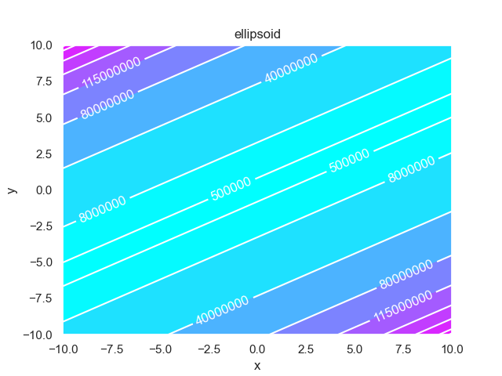
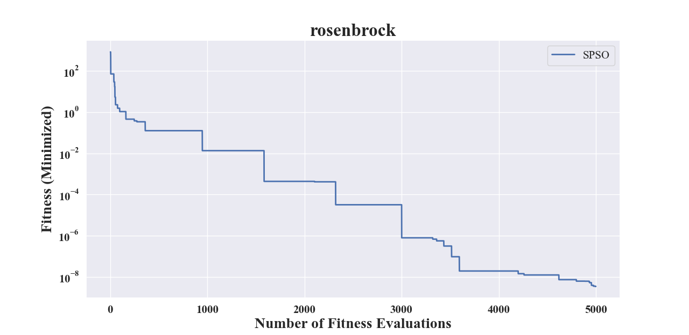
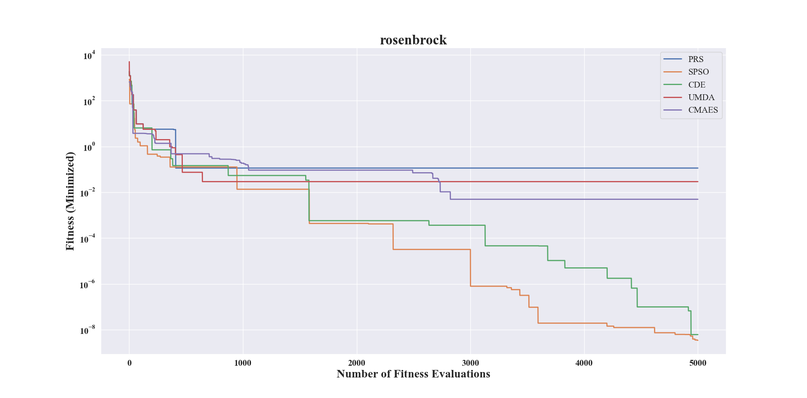
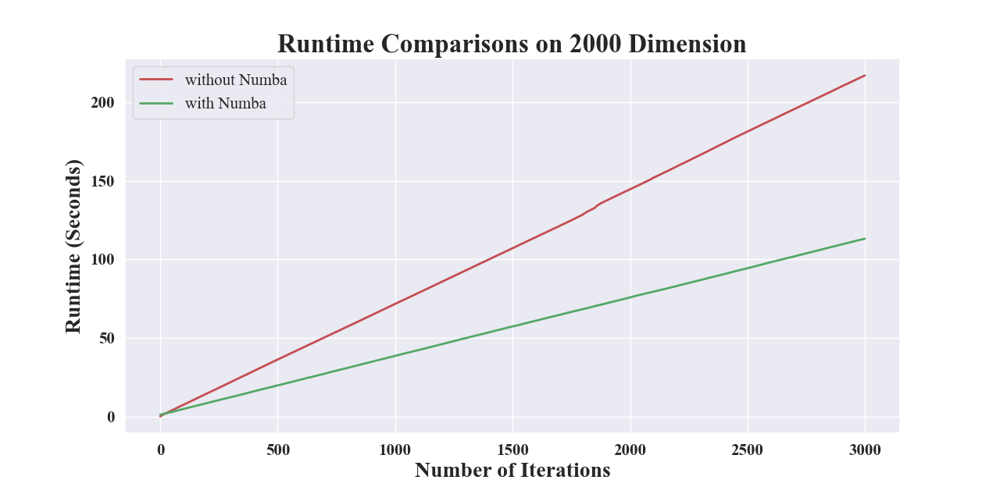

Util Functions for BBO
======================

In this open-source Python module, we have provided some **common** utils functions for BBO, as presented
below. The main purpose of these utils is to simplify the typical **development** and **experiment**
procedures of BBO.

* `Plot 2-D Fitness Landscape <https://pypop.readthedocs.io/en/latest/util-functions-for-BBO.html#plot-2-d-fitness-landscape>`_
* `Plot 3-D Fitness Landscape <https://pypop.readthedocs.io/en/latest/util-functions-for-BBO.html#plot-3-d-fitness-landscape>`_
* `Save Optimization Results via Object Serialization <https://pypop.readthedocs.io/en/latest/util-functions-for-BBO.html#save-optimization-results-via-object-serialization>`_
* `Check Optimization Results <https://pypop.readthedocs.io/en/latest/util-functions-for-BBO.html#check-optimization-results>`_
* `Plot Convergence Curve via Matplotlib <https://pypop.readthedocs.io/en/latest/util-functions-for-BBO.html#plot-convergence-curve-via-matplotlib>`_
* `Compare Multiple Black-Box Optimizers <https://pypop.readthedocs.io/en/latest/util-functions-for-BBO.html#compare-multiple-black-box-optimizers>`_
* `Accelerate Computation via Numba <https://pypop.readthedocs.io/en/latest/util-functions-for-BBO.html#accelerate-computation-via-numba>`_

Plot 2-D Fitness Landscape
--------------------------

.. autofunction:: pypop7.benchmarks.utils.generate_xyz

.. autofunction:: pypop7.benchmarks.utils.plot_contour

The online figure generated in the above Example is shown below:

Plot 3-D Fitness Landscape
--------------------------

.. autofunction:: pypop7.benchmarks.utils.plot_surface

The online figure generated in the above Example is shown below:

.. image:: images/surface_ellipsoid.png
   :width: 321px
   :align: center

Save Optimization Results via Object Serialization
--------------------------------------------------

For **serialization of complex object**, we use the standard library (`pickle
<https://docs.python.org/3/library/pickle.html>`_) of Python.

.. autofunction:: pypop7.benchmarks.utils.save_optimization

Please check the following *local* file in your working space (obtained
via the `pwd()` command):

 * **pypop7_benchmarks_lso/Algo-PRS_Func-rosenbrock_Dim-2_Exp-1.pickle**

.. autofunction:: pypop7.benchmarks.utils.read_optimization

Check Optimization Results
--------------------------

.. autofunction:: pypop7.benchmarks.utils.check_optimization

Plot Convergence Curve via Matplotlib
-------------------------------------

Here we use `Matplotlib <https://matplotlib.org/>`_ to plot a convergence
curve figure for (only) one black-box optimizer.

.. autofunction:: pypop7.benchmarks.utils.plot_convergence_curve

The online figure generated by the above Example is presented below:

Compare Multiple Black-Box Optimizers
-------------------------------------

Here we use `Matplotlib <https://matplotlib.org/>`_ to plot a convergence
curve figure for multiple black-box optimizers.

.. autofunction:: pypop7.benchmarks.utils.plot_convergence_curves

The online figure generated by the above Example is presented below:

Accelerate Computation via Numba
--------------------------------

For some computationally-expensive operations, we use `Numba <https://numba.pydata.org/>`_
to accelerate computation, if possible:

.. autofunction:: pypop7.benchmarks.utils.cholesky_update

For example, for the rank-one update, its runtime comparison with vs without Numba is
presented below:

